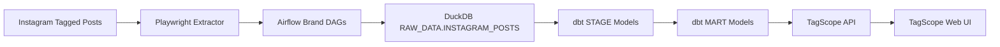
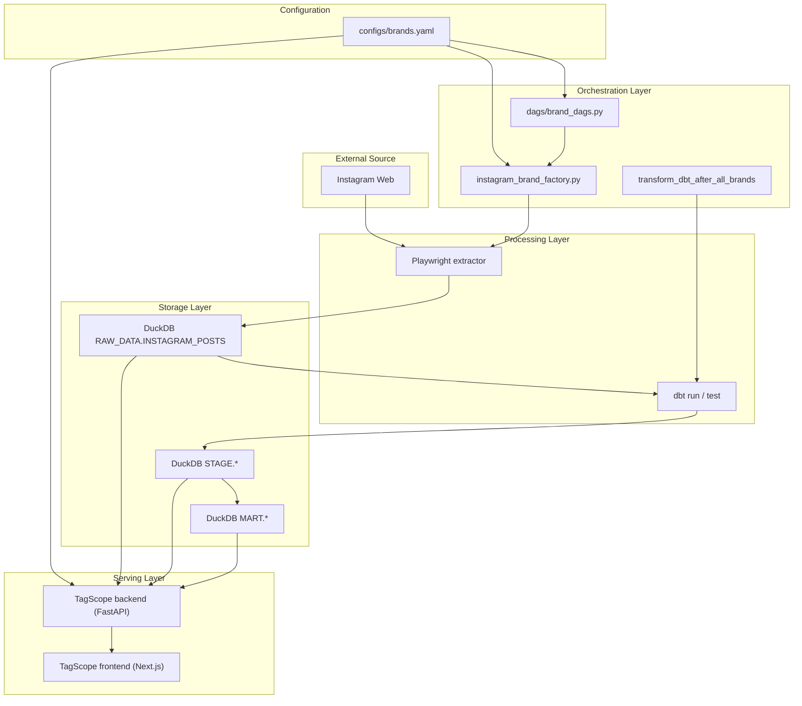
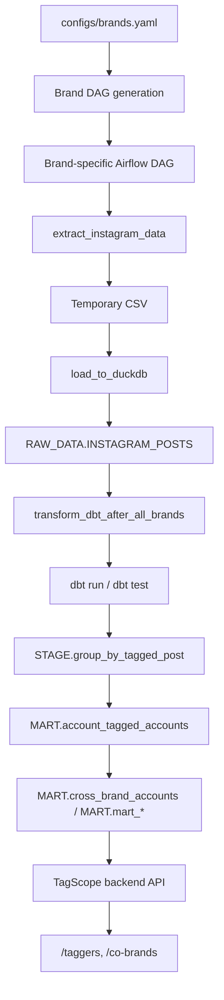

# Architecture Diagram

이 문서는 `insta_pipeline`의 현재 공식 아키텍처를 설명합니다.

중요:

- 이 문서의 기준 시점에서 공식 운영 구조는 `DuckDB + Airflow + dbt + TagScope`입니다.
- 과거 `Snowflake + Streamlit` 설명은 현재 구조가 아니라 히스토리입니다.
- DAG ID prefix에 `snowflake`가 남아 있어도 실제 적재 대상은 DuckDB입니다.

## 1. Current Official Stack

## 2. Runtime Components

## 3. Detailed Data Flow

## 4. Main Responsibilities By Layer

### Source

- Instagram 웹 페이지에서 tagged post 데이터 확인
- 공식 API가 아닌 웹 UI 기반 수집

### Configuration

- `configs/brands.yaml`이 운영 브랜드와 스케줄의 기준
- Airflow DAG 생성과 TagScope 브랜드 목록이 같은 설정을 공유

### Extract

- Playwright로 브랜드 tagged page 접근
- 게시물 ID, 작성자 계정, 링크, 이미지, 날짜, tagged account 수집
- 자기 태그 / 플랫폼 계정 제외 필터 적용

### Orchestration

- Airflow가 브랜드별 수집 스케줄 관리
- `enabled: true` 브랜드만 DAG 등록
- transform DAG가 모든 활성 브랜드의 `load_to_duckdb` 완료를 기다림

### Storage

- 원천 데이터는 DuckDB `RAW_DATA.INSTAGRAM_POSTS`에 적재
- dbt가 같은 DuckDB 파일 안에서 `STAGE`, `MART` 레이어 생성

### Transform

- `group_by_tagged_post`: tagged account 정규화
- `account_tagged_accounts`: 계정별 태그 브랜드 집계
- `cross_brand_accounts`: 공통 계정 기반 교차 브랜드 분석
- `mart_brand_monthly_tagging`, `mart_co_brand_stats`: 요약 지표 / 추이

### Serving

- TagScope backend가 DuckDB를 read-only로 조회
- TagScope frontend가 `/taggers`, `/co-brands` 화면 제공

## 5. Supported Runtime URLs

- Airflow UI: `http://localhost:8082`
- TagScope UI: `http://localhost:3000`
- TagScope API: `http://localhost:8000`
- Health check: `http://localhost:8000/health`

주의:

- `http://localhost:8000/`는 API 루트라서 `404`가 정상입니다.
- 실제 사용자 화면은 `http://localhost:3000/taggers`와 `http://localhost:3000/co-brands`입니다.

## 6. What Changed From Older Docs

헷갈리기 쉬운 변경점을 현재 기준으로 다시 정리하면 아래와 같습니다.

1. `Snowflake` -> `DuckDB`
   저장소의 공식 적재 대상은 이제 `data/insta_pipeline.duckdb`입니다.
2. `Streamlit` -> `TagScope`
   공식 조회 경로는 `streamlit/`이 아니라 `tagscope/`입니다.
3. 고정 DAG 파일 -> `brands.yaml` 기반 동적 DAG 생성
   브랜드 추가 / 비활성화는 `configs/brands.yaml`에서 시작합니다.
4. 단일 UI 문서 -> API + Web 분리
   현재 조회 레이어는 FastAPI backend와 Next.js frontend로 나뉩니다.

## 7. One-Line Summary

이 프로젝트는 Instagram tagged post 데이터를 수집한 뒤, Airflow로 DuckDB 적재를 관리하고, dbt로 분석용 모델을 만든 후, TagScope에서 결과를 확인하는 end-to-end 데이터 파이프라인입니다.
