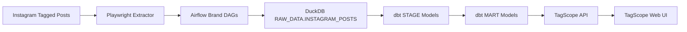
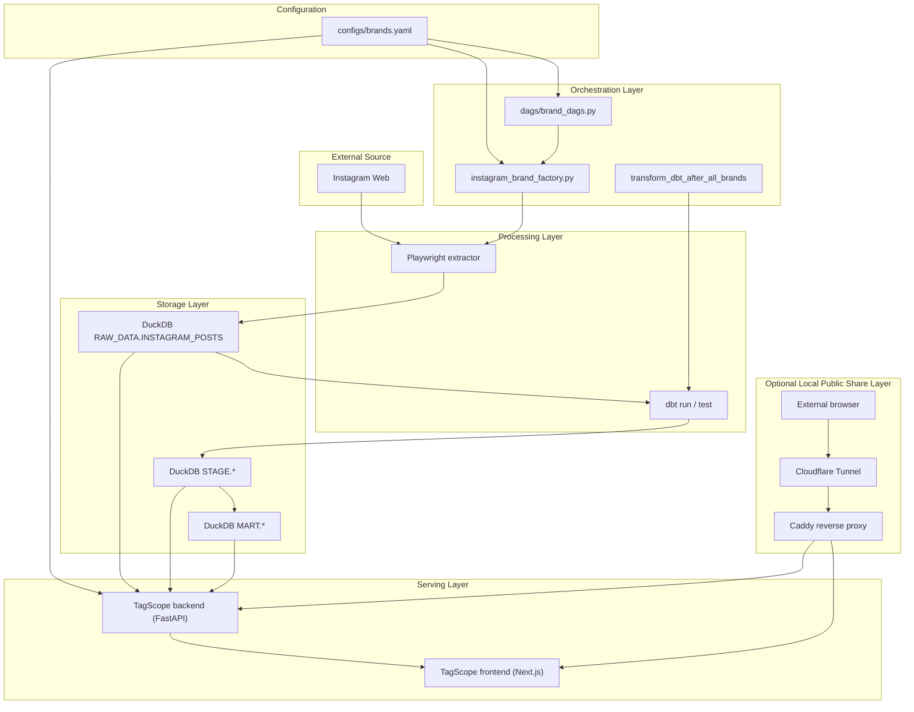
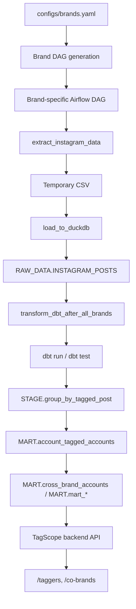
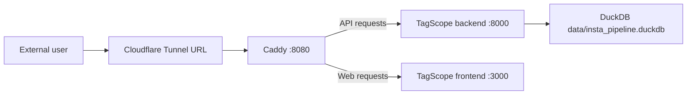
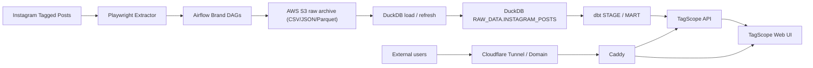

# Architecture Diagram

이 문서는 `insta_pipeline`의 현재 공식 아키텍처를 설명합니다.

중요:

- 이 문서의 기준 시점에서 공식 운영 구조는 `DuckDB + Airflow + dbt + TagScope`입니다.
- 로컬 외부 공유 옵션으로 `Cloudflare Tunnel + Caddy`를 추가했습니다.
- `AWS S3`는 현재 런타임에는 없고, 향후 원본 데이터 보관 계층으로 추가할 수 있는 목표 구조입니다.
- 과거 `Snowflake + Streamlit` 설명은 현재 구조가 아니라 히스토리입니다.
- DAG ID prefix에 `snowflake`가 남아 있어도 실제 적재 대상은 DuckDB입니다.

## 1. Current Official Stack



현재 데이터 저장의 중심은 `data/insta_pipeline.duckdb`입니다.

`AWS S3`는 아직 이 흐름에 포함되어 있지 않습니다.

## 2. Runtime Components



## 3. Detailed Data Flow



## 4. Current Access / Sharing Architecture

기본 로컬 접근은 아래처럼 동작합니다.

```text
내 컴퓨터 브라우저
-> http://localhost:3000/taggers
-> TagScope frontend
-> http://localhost:8000/api/*
-> TagScope backend
-> DuckDB
```

외부 공유 모드는 아래처럼 동작합니다.



이 구조의 목적은 외부 사용자에게 주소 하나만 공유하는 것입니다.

```text
https://something.trycloudflare.com/taggers
https://something.trycloudflare.com/co-brands
https://something.trycloudflare.com/api/brands
```

주의:

- `Cloudflare Tunnel + Caddy`는 조회 접근 경로입니다.
- 데이터 수집 / 적재 / dbt 변환 구조를 바꾸지는 않습니다.
- Airflow UI `8082`는 외부 공유 대상이 아닙니다.
- 임시 `trycloudflare.com` URL은 재실행 시 바뀔 수 있습니다.

관련 파일:

- `docker-compose.share.yaml`
- `docker/Caddyfile.share`
- `docs/operations/local_public_share.md`

## 5. Future Architecture With AWS S3

향후 운영 안정성을 높이려면 DuckDB 앞에 `AWS S3`를 원본 보관 계층으로 추가할 수 있습니다.

현재 구조:

```text
Instagram
-> Airflow / Playwright
-> DuckDB
-> dbt
-> TagScope API
-> TagScope Web UI
```

향후 S3 추가 구조:



S3를 추가하는 이유:

- 크롤러 원본 결과를 장기 보관할 수 있습니다.
- DuckDB 파일이 깨지거나 재생성이 필요할 때 S3 원본에서 복구할 수 있습니다.
- 날짜별 / 브랜드별 원본 데이터를 분리해 추적하기 쉽습니다.
- 나중에 Athena, Glue, Spark 같은 AWS 분석 도구와 연결하기 쉬워집니다.

권장 S3 저장 예시:

```text
s3://<bucket>/instagram_raw/brand=amomento.co/dt=2026-05-06/posts.parquet
s3://<bucket>/instagram_raw/brand=cosstores/dt=2026-05-06/posts.parquet
```

역할 분리:

- `S3`: 수집 원본 보관 / 복구 기준
- `DuckDB`: 현재 조회와 dbt 변환을 위한 분석 DB
- `dbt`: `RAW -> STAGE -> MART` 모델링
- `TagScope`: API / Web UI 조회

S3 추가 시 주의할 점:

- S3는 현재 코드에 아직 구현되어 있지 않습니다.
- `.env`에 AWS credential을 직접 넣는 방식보다 IAM role / profile 기반 접근이 더 안전합니다.
- 원본 저장 포맷은 CSV보다 Parquet이 장기적으로 유리합니다.
- S3 추가 후에도 TagScope는 DuckDB를 조회하는 구조를 유지하는 편이 단순합니다.

## 6. Main Responsibilities By Layer

### Source

- Instagram 웹 페이지에서 tagged post 데이터 확인
- 공식 API가 아닌 웹 UI 기반 수집

### Configuration

- `configs/brands.yaml`이 운영 브랜드와 스케줄의 기준
- Airflow DAG 생성과 TagScope 브랜드 목록이 같은 설정을 공유

### Extract

- Playwright로 브랜드 tagged page 접근
- 게시물 ID, 작성자 계정, 링크, 이미지, 날짜, tagged account 수집
- 자기 태그 / 플랫폼 계정 제외 필터 적용

### Orchestration

- Airflow가 브랜드별 수집 스케줄 관리
- `enabled: true` 브랜드만 DAG 등록
- transform DAG가 모든 활성 브랜드의 `load_to_duckdb` 완료를 기다림

### Storage

- 원천 데이터는 DuckDB `RAW_DATA.INSTAGRAM_POSTS`에 적재
- dbt가 같은 DuckDB 파일 안에서 `STAGE`, `MART` 레이어 생성
- 향후 S3를 추가하면 S3는 원본 archive, DuckDB는 분석 DB 역할로 분리

### Transform

- `group_by_tagged_post`: tagged account 정규화
- `account_tagged_accounts`: 계정별 태그 브랜드 집계
- `cross_brand_accounts`: 공통 계정 기반 교차 브랜드 분석
- `mart_brand_monthly_tagging`, `mart_co_brand_stats`: 요약 지표 / 추이

### Serving

- TagScope backend가 DuckDB를 read-only로 조회
- TagScope frontend가 `/taggers`, `/co-brands` 화면 제공
- 외부 공유 모드에서는 Caddy가 `/api/*`는 backend로, 나머지는 frontend로 라우팅

## 7. Supported Runtime URLs

- Airflow UI: `http://localhost:8082`
- TagScope UI: `http://localhost:3000`
- TagScope API: `http://localhost:8000`
- Health check: `http://localhost:8000/health`
- Local public-share entrypoint: `http://localhost:8088`
- Temporary external share URL: `https://<generated>.trycloudflare.com`

주의:

- `http://localhost:8000/`는 API 루트라서 `404`가 정상입니다.
- 실제 사용자 화면은 `http://localhost:3000/taggers`와 `http://localhost:3000/co-brands`입니다.
- 외부 공유 시에는 `http://localhost:8088/taggers` 또는 Cloudflare Tunnel URL을 사용합니다.

## 8. What Changed From Older Docs

헷갈리기 쉬운 변경점을 현재 기준으로 다시 정리하면 아래와 같습니다.

1. `Snowflake` -> `DuckDB`
   저장소의 공식 적재 대상은 이제 `data/insta_pipeline.duckdb`입니다.
2. `Streamlit` -> `TagScope`
   공식 조회 경로는 `streamlit/`이 아니라 `tagscope/`입니다.
3. 고정 DAG 파일 -> `brands.yaml` 기반 동적 DAG 생성
   브랜드 추가 / 비활성화는 `configs/brands.yaml`에서 시작합니다.
4. 단일 UI 문서 -> API + Web 분리
   현재 조회 레이어는 FastAPI backend와 Next.js frontend로 나뉩니다.
5. 로컬 전용 조회 -> 선택적 외부 공유
   `Cloudflare Tunnel + Caddy`로 로컬 TagScope를 외부에 임시 공유할 수 있습니다.

## 9. One-Line Summary

이 프로젝트는 Instagram tagged post 데이터를 수집한 뒤, Airflow로 DuckDB 적재를 관리하고, dbt로 분석용 모델을 만든 후, TagScope에서 결과를 확인하는 end-to-end 데이터 파이프라인입니다.

현재 외부 공유는 `Cloudflare Tunnel + Caddy`로 처리하고, 향후에는 `AWS S3`를 원본 보관 계층으로 추가해 복구성과 운영 안정성을 높일 수 있습니다.
