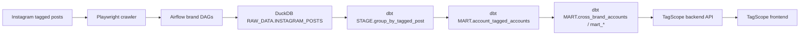

# Instagram 공동 태그 분석 파이프라인

## 1. 프로젝트 개요

이 프로젝트는 Instagram에서 브랜드가 태그된 게시물을 수집하고, 이를 분석 가능한 데이터셋으로 정제한 뒤, TagScope에서 브랜드 간 취향 유사도와 타겟층 겹침을 탐색할 수 있게 만든 데이터 파이프라인입니다.

현재 공식 운영 기준은 아래와 같습니다.

- 수집: Playwright 기반 Instagram crawler
- 오케스트레이션: Airflow
- 저장: DuckDB
- 변환: dbt
- 조회: TagScope (`FastAPI + Next.js`)

즉, 지금 이 프로젝트는 "Instagram 데이터를 DuckDB에 적재하고, dbt로 변환한 뒤, TagScope에서 분석 결과를 조회하는 구조"입니다.

---

## 2. 왜 이 데이터를 수집했는가

이 프로젝트를 시작한 이유는 유저들이 좋아하는 브랜드 간 유사도를 탐색하고, 취향이 비슷한 타겟층을 찾고 싶었기 때문입니다.

Instagram에서 한 유저가 여러 브랜드를 함께 태그한다는 것은 단순 노출이 아니라, 실제 취향이나 관심사가 겹친다는 신호로 볼 수 있습니다.

즉, 이 프로젝트는 아래 같은 질문에 답하기 위한 구조입니다.

- 특정 브랜드를 태그하는 유저들은 어떤 다른 브랜드에도 반응하는가
- 브랜드 간 잠재 고객층이 얼마나 겹치는가
- 공통 유저층은 추가로 어떤 브랜드를 자주 태그하는가
- 협업 후보가 될 만한 인접 브랜드 조합은 무엇인가

---

## 3. 현재 데이터 흐름 구조

### Configuration

- 운영 브랜드, DAG ID, 스케줄의 source of truth는 `configs/brands.yaml`
- Airflow DAG 생성과 TagScope 브랜드 목록이 이 설정을 함께 사용

### Raw

- 역할:
  Instagram에서 수집한 tagged post 원본을 보존하는 계층
- 생성 위치:
  `DuckDB RAW_DATA.INSTAGRAM_POSTS`
- 처리 방식:
  Playwright crawler 결과를 Airflow가 DuckDB에 UPSERT
- 담는 값:
  게시물 ID, 작성자 계정, 브랜드명, 게시물 링크, 이미지, 게시일, 함께 태그된 계정 목록 등

### Stage

- 역할:
  게시물 단위 원본 데이터를 분석 가능한 관계형 데이터로 변환
- 대표 모델:
  `STAGE.group_by_tagged_post`
- 처리 방식:
  - `tagged_insta_id` 문자열 분해
  - tagged account를 행 단위로 펼침
  - 공백 제거, `@` 제거, 소문자 통일, 빈 값 제거

### Mart

- 역할:
  브랜드 유사도와 타겟층 overlap을 해석할 수 있도록 집계
- 대표 모델:
  - `MART.account_tagged_accounts`
  - `MART.cross_brand_accounts`
  - `MART.mart_brand_monthly_tagging`
  - `MART.mart_co_brand_stats`

이 단계는 단순 저장이 아니라 실제로 "브랜드 간 유사도"를 볼 수 있는 분석용 결과물을 만드는 단계입니다.

### Serve

- 역할:
  분석 결과를 탐색 가능한 데이터 제품으로 제공
- backend:
  FastAPI가 DuckDB를 read-only로 조회
- frontend:
  Next.js 기반 TagScope UI
- 주요 화면:
  - `/taggers`
  - `/co-brands`

---

## 4. 결과물 예시

이 프로젝트의 결과물은 raw 테이블이 아니라 바로 해석 가능한 분석 결과 형태로 이어집니다.

### 예시 1. 공통 태그 계정 목록

- 선택한 브랜드들을 모두 함께 태그한 계정 목록
- 각 계정이 선택 브랜드를 총 몇 번 태그했는지
- 최근 게시물 날짜와 프로필 링크

### 예시 2. 선택 브랜드 외 추가 태그 브랜드 Top N

- 공통 계정들이 선택 브랜드 외에 어떤 다른 브랜드를 자주 함께 태그했는지 집계
- 브랜드 수 기준 상위 항목 조회

### 예시 3. 계정별 게시물 상세 태그 내역

- 특정 계정이 올린 게시물별 tagged account 목록
- 게시물 날짜, 원본 링크, 게시물별 전체 tagged account 확인

### 예시 4. 월별 태깅 추이

- 특정 브랜드가 월별로 얼마나 자주 등장하는지
- 공통 브랜드가 특정 시점에만 급증했는지 확인

---

## 5. 이 데이터로 얻을 수 있는 비즈니스 인사이트

### 1. 브랜드 간 취향 유사도 탐색

함께 태그되는 브랜드 조합을 보면, 어떤 브랜드들이 비슷한 취향의 유저층 안에서 소비되는지 파악할 수 있습니다.

### 2. 타겟층 overlap 분석

같은 계정들이 여러 브랜드를 반복적으로 태그한다면, 해당 브랜드들은 일부 타겟층을 공유하고 있을 가능성이 높습니다.

### 3. 협업 / 제휴 후보 탐색

공통 유저층 안에서 자주 같이 등장하는 브랜드는 협업이나 공동 캠페인 관점에서도 의미가 있습니다.

### 4. 데이터 기반 브랜드 맵 구성

브랜드를 개별적으로 보는 것이 아니라, 유저 취향 네트워크 안에서 상대적인 위치로 해석할 수 있습니다.

---

## 6. 내가 이 프로젝트에서 구현한 것

이 프로젝트에서 직접 설계하고 구현한 핵심은 아래와 같습니다.

- Playwright 기반 Instagram crawler 구현
- `configs/brands.yaml` 기반 동적 Airflow DAG 구조 구성
- DuckDB raw 적재 및 incremental UPSERT 구조 구성
- dbt를 활용한 `RAW / STAGE / MART` 모델링
- FastAPI + Next.js 기반 TagScope 조회 레이어 구성

즉, 단순히 데이터를 모으는 데서 끝나지 않고, 수집부터 적재, 정제, 집계, 조회까지 이어지는 end-to-end 데이터 파이프라인을 직접 구성했습니다.

---

## 7. 이전 구조와 현재 구조의 차이

과거 문서에는 `Snowflake + Streamlit` 구조가 남아 있을 수 있지만, 현재 공식 구조는 다릅니다.

- 저장소: Snowflake -> DuckDB
- 조회 레이어: Streamlit -> TagScope
- DAG 구성: 고정 DAG 파일 -> `brands.yaml` 기반 동적 DAG 생성

이 문서에서는 현재 구조만 기준으로 설명합니다.

---

## 8. 한 줄 정리

이 프로젝트는 Instagram tagged post 데이터를 활용해 브랜드 간 취향 유사도와 겹치는 타겟층을 탐색할 수 있도록 만든 `DuckDB + Airflow + dbt + TagScope` 기반 end-to-end 데이터 파이프라인입니다.
