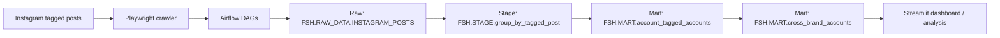

# Instagram 공동 태그 분석 파이프라인

## 1. 프로젝트 개요

이 프로젝트는 Instagram에서 브랜드가 태그된 게시물을 수집하고, 이를 분석 가능한 데이터셋으로 정제해 브랜드 간 취향 유사도와 타겟층 겹침을 탐색하는 데이터 파이프라인입니다.

단순히 게시물 수를 세는 것이 아니라, "어떤 유저가 어떤 브랜드들을 함께 태그하는가"를 관계 데이터로 해석하는 데 초점을 맞췄습니다. 이를 통해 비슷한 취향을 가진 유저군을 찾고, 브랜드 간 잠재적인 audience overlap을 파악할 수 있도록 설계했습니다.

이 프로젝트는 다음 질문에 답하기 위해 만들었습니다.

- 특정 브랜드를 태그하는 유저들은 어떤 다른 브랜드에도 반응하는가
- 브랜드 간 잠재 고객층이 얼마나 겹치는가
- 비슷한 취향군이 함께 언급하는 브랜드는 무엇인가
- 교차 관심사 기반으로 협업 가능성이 있는 브랜드 조합은 무엇인가

---

## 2. 왜 이 데이터를 수집했는가

이 프로젝트를 시작한 이유는 유저들이 좋아하는 브랜드 간 유사도를 탐색하고, 취향이 비슷한 타겟층을 찾고 싶었기 때문입니다.

Instagram에서 한 유저가 여러 브랜드를 함께 태그한다는 것은 단순 노출이 아니라, 실제 취향이나 관심사가 겹친다는 신호로 볼 수 있습니다. 저는 이 지점을 데이터로 확인하고 싶었습니다.

즉, 이 프로젝트는 "어떤 게시물이 많았는가"를 보는 프로젝트가 아니라, 아래와 같은 관계를 찾기 위한 프로젝트였습니다.

- 어떤 브랜드들이 같은 유저층 안에서 반복적으로 같이 등장하는가
- 어떤 계정이 여러 브랜드를 연결하는 허브 역할을 하는가
- 우리 브랜드와 취향이 비슷한 잠재 고객층은 어떤 브랜드에도 함께 반응하는가

결국 이 데이터는 브랜드 인지도 자체보다도, 브랜드 간 취향 연결 구조를 이해하기 위한 재료로 수집했습니다.

---

## 3. 데이터 흐름 구조

### Raw

- 역할:
  Instagram에서 수집한 tagged post 원본을 보존하는 계층
- 입력 데이터:
  브랜드별 크롤링 결과 CSV
- 처리 방식:
  Playwright crawler로 수집한 결과를 Airflow가 Snowflake에 적재
- 생성 테이블:
  `FSH.RAW_DATA.INSTAGRAM_POSTS`
- 담는 값:
  게시물 ID, 작성자 계정, 브랜드명, 게시물 링크, 이미지, 게시일, 함께 태그된 계정 목록 등

이 단계의 목적은 분석보다 원본 보존입니다. 나중에 정제 로직이 바뀌더라도 다시 가공할 수 있도록 수집 시점의 데이터를 남깁니다.

### Stage

- 역할:
  게시물 단위 원본 데이터를 분석 가능한 관계형 데이터로 변환하는 계층
- 입력 데이터:
  `FSH.RAW_DATA.INSTAGRAM_POSTS`
- 처리 방식:
  - `tagged_insta_id` 문자열을 쉼표 기준으로 분해
  - 함께 태그된 계정을 하나씩 행 단위로 펼침
  - 공백 제거, `@` 제거, 끝의 `.` 제거, 소문자 통일
  - `NULL` 또는 빈 문자열 태그는 제외
- 생성 테이블:
  `FSH.STAGE.group_by_tagged_post`

예를 들어 게시물 1건에 `@nike, @newbalance, @hoka.`가 들어 있으면, Stage에서는 이를 3개의 행으로 나누어 저장합니다. 이 과정을 통해 "한 게시물 안에 어떤 계정들이 함께 등장했는가"를 바로 분석할 수 있는 구조가 됩니다.

### Mart

- 역할:
  브랜드 유사도와 타겟층 overlap을 해석할 수 있도록 집계하는 계층
- 입력 데이터:
  `FSH.STAGE.group_by_tagged_post`
- 생성 테이블:
  - `FSH.MART.account_tagged_accounts`
  - `FSH.MART.cross_brand_accounts`
- 처리 방식:
  - 계정별로 어떤 브랜드를 함께 태그했는지 집계
  - 함께 태그한 브랜드 수와 목록을 계정 단위로 정리
  - 최종적으로 교차 브랜드 관심사를 분석 가능한 형태로 제공

이 단계는 단순 데이터 저장이 아니라, 실제로 "브랜드 간 유사도"를 볼 수 있는 분석용 결과물을 만드는 단계입니다.

---

## 4. 결과물 예시

이 프로젝트의 결과물은 단순 raw 테이블이 아니라, 바로 해석 가능한 분석 결과 형태로 이어집니다.

### 예시 1. 공통 태그 계정 목록

- 선택한 브랜드들을 모두 함께 태그한 계정 목록
- 각 계정이 선택 브랜드를 총 몇 번 태그했는지
- 최근 게시물 날짜와 프로필 링크

예시 질문:

- `amomento`와 `cos`를 모두 태그한 계정은 누구인가
- 이 계정들은 해당 브랜드를 얼마나 반복적으로 언급했는가

### 예시 2. 선택 브랜드 외 추가 태그 계정 Top 10

- 공통 계정들이 선택 브랜드 외에 어떤 다른 계정을 자주 함께 태그했는지 집계
- 계정 수 기준 상위 브랜드를 보여줌

예시 질문:

- `amomento`, `cos`를 함께 태그한 유저들은 추가로 어떤 브랜드를 가장 많이 태그하는가
- 그 결과를 통해 어떤 브랜드가 비슷한 취향군 안에 함께 존재하는가

### 예시 3. 계정별 게시물 상세 태그 내역

- 특정 계정이 올린 게시물별 태그 계정 목록
- 게시물 날짜, 원본 링크, 게시물별 전체 tagged account 확인 가능

예시 질문:

- 상위 공통 계정 한 명은 실제 게시물에서 어떤 브랜드들을 함께 태그했는가
- 이 계정이 단발성으로 태그한 것인지, 반복적으로 비슷한 브랜드군을 언급하는지 확인할 수 있는가

---

## 5. 이 데이터로 얻을 수 있는 비즈니스 인사이트

이 프로젝트는 단순 수집 자동화보다, 마케팅과 브랜드 분석에 활용 가능한 인사이트를 만드는 데 더 큰 의미가 있습니다.

### 1. 브랜드 간 취향 유사도 탐색

함께 태그되는 브랜드 조합을 보면, 어떤 브랜드들이 비슷한 취향의 유저층 안에서 소비되는지 파악할 수 있습니다.

활용 예시:

- 우리 브랜드와 취향이 비슷한 경쟁 브랜드 또는 인접 브랜드 파악
- 브랜드 포지셔닝 비교

### 2. 타겟층 overlap 분석

같은 계정들이 여러 브랜드를 반복적으로 태그한다면, 해당 브랜드들은 일부 타겟층을 공유하고 있을 가능성이 높습니다.

활용 예시:

- lookalike audience 발굴
- 광고 타겟 확장 아이디어 도출

### 3. 협업/제휴 후보 탐색

공통 유저층 안에서 자주 같이 등장하는 브랜드는 협업이나 공동 캠페인 관점에서도 의미가 있습니다.

활용 예시:

- 브랜드 콜라보 후보 탐색
- 콘텐츠 공동 기획 후보 선정

### 4. 데이터 기반 브랜드 맵 구성

브랜드를 개별적으로 보는 것이 아니라, 유저 취향 네트워크 안에서 상대적인 위치로 해석할 수 있습니다.

활용 예시:

- 우리 브랜드 주변의 연관 브랜드 군집 파악
- 신규 브랜드 진입 시 인접 시장 이해

---

## 6. 내가 이 프로젝트에서 구현한 것

이 프로젝트에서 제가 직접 설계하고 구현한 핵심은 아래와 같습니다.

- Playwright 기반 Instagram crawler 구현
- Airflow DAG 기반 수집/적재 자동화
- Snowflake raw 적재 및 incremental upsert 구조 구성
- dbt를 활용한 Stage/Mart 모델링
- Streamlit 대시보드로 분석 결과 탐색 가능하게 제공

즉, 단순히 데이터를 모으는 데서 끝나지 않고, 수집부터 적재, 정제, 집계, 조회까지 이어지는 end-to-end 데이터 파이프라인을 직접 구성했습니다.

---

## 7. 한 줄 정리

이 프로젝트는 Instagram tagged post 데이터를 활용해 브랜드 간 취향 유사도와 겹치는 타겟층을 탐색할 수 있도록 만든 end-to-end 데이터 파이프라인 프로젝트입니다.
