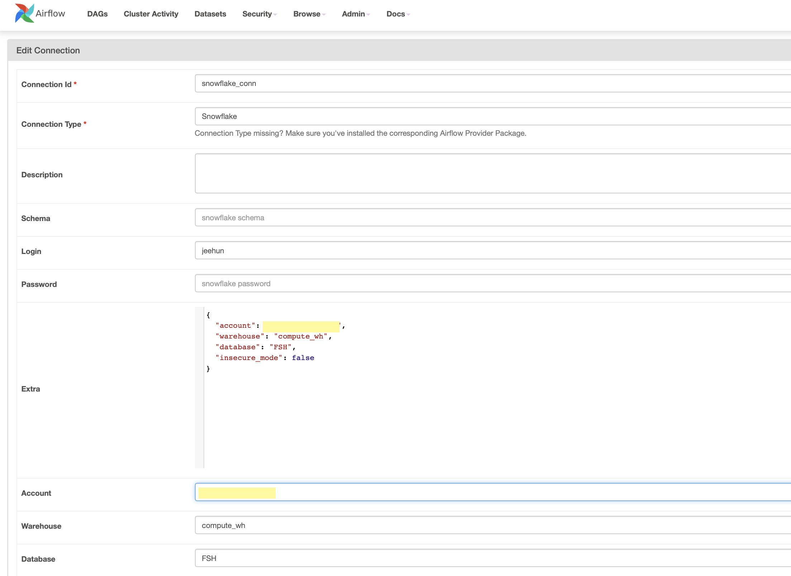

## insta_pipeline 설치 및 실행 가이드

이 문서는 처음 보는 사람도 이 프로젝트를 로컬에서 실행할 수 있게 정리한 안내서입니다.

프로젝트는 아래 순서로 동작합니다.

1. Instagram tagged post 수집
2. Snowflake raw 적재
3. dbt 변환
4. Streamlit 조회

---

## 1. 먼저 준비할 것

필수 준비물:

1. Docker Desktop
2. Snowflake 계정
3. Instagram 로그인 정보
4. 이 프로젝트 폴더

왜 필요한가:

- Docker가 없으면 Airflow/Streamlit/dbt가 안 뜹니다.
- Snowflake가 없으면 적재와 조회가 실패합니다.
- Instagram 로그인 정보와 세션이 없으면 tagged 페이지 접근이 막힙니다.

---

## 2. `.env` 파일 만들기

프로젝트 루트에 `.env` 파일을 만듭니다.

예시:

```env
SNOWFLAKE_ACCOUNT=<your_account>
SNOWFLAKE_USER=<your_user>
SNOWFLAKE_PASSWORD=<your_password>
SNOWFLAKE_ROLE=ACCOUNTADMIN
SNOWFLAKE_WAREHOUSE=COMPUTE_WH
SNOWFLAKE_DATABASE=FSH
SNOWFLAKE_SCHEMA=STAGE

ID=<instagram_username_or_email>
PW=<instagram_password>

HOST_PROJECT_ROOT=/absolute/path/to/insta_pipeline
AIRFLOW_PROJ_DIR=.
AIRFLOW_UID=50000
_AIRFLOW_WWW_USER_USERNAME=airflow
_AIRFLOW_WWW_USER_PASSWORD=airflow
```

설명:

- `SNOWFLAKE_DATABASE=FSH`
  dbt와 Streamlit이 공통으로 사용할 database입니다.
- `SNOWFLAKE_SCHEMA=STAGE`
  dbt 결과와 Streamlit 조회 기준 schema입니다.
- `ID`, `PW`
  Instagram 로그인 정보입니다.
- `.env`는 절대 Git에 커밋하지 않습니다.

중요:

- Airflow 적재는 `.env`만 보지 않습니다.
- Airflow UI 안의 `snowflake_conn` connection도 별도로 설정해야 합니다.

---

## 3. Snowflake에서 먼저 준비할 것

이 프로젝트 기준 Snowflake 구조는 아래입니다.

- database: `FSH`
- raw schema: `RAW_DATA`
- stage schema: `STAGE`
- mart schema: `MART`
- raw table: `FSH.RAW_DATA.INSTAGRAM_POSTS`
- stage model 예시: `FSH.STAGE.group_by_tagged_post`
- Streamlit 조회 대상: `FSH.MART.*`

현재 코드 기준 자동 생성 범위:

1. Airflow 적재 시 `RAW_DATA` schema가 없으면 자동 생성
2. Airflow 적재 시 `INSTAGRAM_POSTS` table이 없으면 자동 생성

자동 생성에 기대하지 말아야 하는 것:

1. `FSH` database
2. `STAGE` schema
3. `MART` schema

이유:

- dbt는 `.env`의 `SNOWFLAKE_DATABASE`, `SNOWFLAKE_SCHEMA`를 사용합니다.
- 현재 기본 예시는 `FSH.STAGE`입니다.
- dbt stage 모델은 `FSH.STAGE`에 생성되고, `marts/` 폴더 모델은 `FSH.MART`에 생성됩니다.
- Streamlit 쿼리는 `FSH.MART.cross_brand_accounts`와 `FSH.STAGE.group_by_tagged_post`를 함께 조회합니다.

따라서 처음 세팅할 때 아래 SQL을 한 번에 실행하는 것이 가장 안전합니다.

중요:

- 이 SQL은 Snowflake Worksheet에서 사람이 직접 한 번 실행해야 합니다.
- Airflow나 dbt가 대신 만들어주는 것이 아닙니다.
- 특히 `FSH.MART`는 dbt 결과를 저장하는 공간이므로, 먼저 만들어져 있어야 합니다.

```sql
CREATE DATABASE IF NOT EXISTS FSH;
CREATE SCHEMA IF NOT EXISTS FSH.RAW_DATA;
CREATE SCHEMA IF NOT EXISTS FSH.STAGE;
CREATE SCHEMA IF NOT EXISTS FSH.MART;
```

권한 예시:

```sql
GRANT USAGE ON DATABASE FSH TO ROLE ACCOUNTADMIN;
GRANT USAGE ON SCHEMA FSH.RAW_DATA TO ROLE ACCOUNTADMIN;
GRANT USAGE ON SCHEMA FSH.STAGE TO ROLE ACCOUNTADMIN;
GRANT USAGE ON SCHEMA FSH.MART TO ROLE ACCOUNTADMIN;

GRANT CREATE TABLE ON SCHEMA FSH.RAW_DATA TO ROLE ACCOUNTADMIN;
GRANT CREATE TABLE ON SCHEMA FSH.STAGE TO ROLE ACCOUNTADMIN;
GRANT CREATE VIEW ON SCHEMA FSH.STAGE TO ROLE ACCOUNTADMIN;
GRANT CREATE TABLE ON SCHEMA FSH.MART TO ROLE ACCOUNTADMIN;
GRANT CREATE VIEW ON SCHEMA FSH.MART TO ROLE ACCOUNTADMIN;

GRANT USAGE ON WAREHOUSE COMPUTE_WH TO ROLE ACCOUNTADMIN;
```

주의:

- Airflow connection에서 `database` 값을 비운다고 `FSH`가 자동 생성되지는 않습니다.
- 오히려 어떤 DB에 접속해서 schema를 만들지 애매해져서 실패합니다.
- `RAW_DATA`는 일부 코드가 자동 생성할 수 있어도, `STAGE`와 `MART`는 처음에 직접 준비해두는 것이 가장 안전합니다.

Snowflake 계정 화면 예시는 아래 이미지를 참고합니다.



---

## 4. Instagram 세션 파일 준비

이 프로젝트는 [storage_state.json](/Users/jeehun/Desktop/insta_pipeline/secrets/storage_state.json)을 사용합니다.

이 파일은 Instagram 로그인 상태를 저장하는 파일입니다.

처음 세팅하거나 세션이 만료된 경우 직접 만들어야 합니다.

### 4-1. 터미널 열기

맥 기준:

1. `Command + Space`
2. `Terminal` 입력
3. 엔터

### 4-2. 프로젝트 폴더로 이동

```bash
cd /Users/jeehun/Desktop/insta_pipeline
```

현재 위치 확인:

```bash
pwd
```

출력 예시:

```bash
/Users/jeehun/Desktop/insta_pipeline
```

### 4-3. 로컬에서 한 번만 필요한 패키지 설치

`save_state.py`는 로컬 브라우저를 직접 띄우는 스크립트입니다.

```bash
python3 -m pip install -r requirements.txt
python3 -m playwright install chromium
```

만약 `pip`가 없다고 나오면:

```bash
python3 -m ensurepip --upgrade
python3 -m pip install -r requirements.txt
python3 -m playwright install chromium
```

### 4-4. `.env` 확인

`save_state.py`는 프로젝트 루트의 `.env`에서 아래 값을 읽습니다.

```env
ID=<instagram_username_or_email>
PW=<instagram_password>
```

이 값이 비어 있으면 세션 파일을 만들 수 없습니다.

### 4-5. 세션 저장 실행

```bash
python3 secrets/save_state.py
```

실행하면 브라우저 창이 열립니다.

스크립트가 하는 일:

1. `.env`에서 `ID`, `PW`를 읽음
2. Instagram 로그인 페이지를 엶
3. 로그인 후 `sessionid` 쿠키가 생겼는지 확인
4. 로그인 상태를 [storage_state.json](/Users/jeehun/Desktop/insta_pipeline/secrets/storage_state.json)에 저장

정상 완료 메시지 예시:

```bash
✅ 저장 완료: /Users/jeehun/Desktop/insta_pipeline/secrets/storage_state.json
```

### 4-6. 실패했을 때 확인할 파일

로그인 실패나 추가 인증 때문에 저장이 안 되면 아래 파일이 생성될 수 있습니다.

- [login_failed.png](/Users/jeehun/Desktop/insta_pipeline/secrets/login_failed.png)

이 이미지를 보면 어떤 화면에서 멈췄는지 확인할 수 있습니다.

세션 파일이 없거나 만료되면:

- tagged 페이지가 로그인 화면으로 리다이렉트될 수 있습니다.
- 크롤링이 실패할 수 있습니다.

---

## 5. Docker로 서비스 실행

터미널에서 프로젝트 루트로 이동한 뒤 실행합니다.

```bash
cd /Users/jeehun/Desktop/insta_pipeline
docker compose up -d --build
```

이 명령으로 아래 서비스가 올라옵니다.

- airflow
- postgres
- streamlit

상태 확인:

```bash
docker compose ps
```

---

## 6. 접속 주소

브라우저에서 아래 주소로 접속합니다.

1. Airflow: [http://localhost:8082](http://localhost:8082)
2. Streamlit: [http://localhost:8501](http://localhost:8501)

---

## 7. Airflow에서 `snowflake_conn` 설정

Airflow에서 아래 순서로 이동합니다.

1. `Admin`
2. `Connections`
3. `+` 버튼 클릭

아래처럼 입력합니다.

- `Conn Id`: `snowflake_conn`
- `Conn Type`: `Snowflake`
- `Login`: Snowflake 사용자명
- `Password`: Snowflake 비밀번호
- `Schema`: `RAW_DATA`

그리고 Extra 또는 필수 필드에 아래 값이 들어가야 합니다.

- `account`
- `warehouse`
- `database`: `FSH`
- `schema`: `RAW_DATA`
- `role`

왜 중요한가:

- Airflow 적재 task는 여기 등록된 `snowflake_conn`을 사용합니다.
- `.env`만 맞고 Airflow Connection이 틀리면 적재는 실패합니다.

예시 화면:


구분해서 기억할 것:

- Airflow raw 적재: `FSH.RAW_DATA.INSTAGRAM_POSTS`
- dbt stage: `FSH.STAGE.*`
- dbt mart / Streamlit 조회: `FSH.MART.*`

즉:

- `database=FSH`는 connection에 직접 넣어야 합니다.
- DAG 코드는 `RAW_DATA` schema와 `INSTAGRAM_POSTS` table까지만 자동 생성합니다.
- `STAGE`, `MART` schema는 사람이 미리 준비해두는 것이 안전합니다.

---

## 8. 실행 순서

처음 세팅할 때는 아래 순서로 진행합니다.

1. `.env` 작성
2. Snowflake에 `FSH`, `RAW_DATA`, `STAGE`, `MART` 준비
3. `secrets/storage_state.json` 생성
4. `docker compose up -d --build`
5. Airflow 접속
6. `snowflake_conn` 생성
7. 브랜드 DAG 실행

---

## 9. 정상 실행 확인

Airflow에서 확인할 것:

1. 브랜드 DAG가 보이는지
2. `extract_instagram_data`가 성공하는지
3. `load_to_snowflake`가 성공하는지
4. 후속 dbt DAG가 도는지

Streamlit에서 확인할 것:

1. 화면이 열리는지
2. 브랜드 선택이 되는지
3. 결과 테이블이 조회되는지

---

## 10. 자주 발생하는 문제

### 문제 1. Airflow import가 에디터에서 빨갛게 보임

원인:

- Airflow는 Docker 컨테이너 안에 설치되어 있고, 로컬 IDE는 다른 Python 인터프리터를 볼 수 있습니다.

해석:

- 실행 문제일 수도 있지만, 단순 IDE 표시 문제일 수도 있습니다.

### 문제 2. Snowflake 연결 실패

확인할 것:

1. Airflow `snowflake_conn`이 새 계정을 보고 있는지
2. trial이 끝난 예전 계정을 보고 있지 않은지
3. `database=FSH`가 맞는지
4. warehouse가 suspend 상태가 아닌지

### 문제 3. `USE SCHEMA RAW_DATA` 에서 실패

원인 후보:

1. `FSH` database가 없음
2. `FSH`는 있지만 권한이 없음
3. Airflow connection의 `database` 값이 비어 있거나 다른 DB를 가리킴

정리:

- `RAW_DATA`와 `INSTAGRAM_POSTS`는 코드가 자동 생성 가능
- `FSH` database는 사람이 먼저 준비해야 함
- `STAGE`, `MART` schema도 처음에 같이 생성해두는 것이 안전함

### 문제 4. 크롤링 실패

확인할 것:

1. [storage_state.json](/Users/jeehun/Desktop/insta_pipeline/secrets/storage_state.json)이 있는지
2. Instagram 세션이 만료되지 않았는지
3. Instagram DOM이 바뀌지 않았는지

### 문제 5. 상세 페이지/팝업 동작이 불안정함

현재 운영 extractor는 grid 페이지는 그대로 두고, 게시물 상세는 별도 detail page에서 읽습니다.

이유:

- 원본 grid 스크롤 위치를 유지하기 위해서입니다.
- Instagram 웹 UI가 바뀌어도 popup 클릭 동작에 덜 의존하기 위해서입니다.

---

## 11. 종료와 재실행

종료:

```bash
docker compose down
```

다시 실행:

```bash
docker compose up -d
```

코드 변경까지 반영해서 다시 빌드:

```bash
docker compose up -d --build
```

---

## 12. 한 줄 요약

처음 세팅은 아래 순서로 보면 됩니다.

1. `.env` 작성
2. Snowflake에 `FSH`, `RAW_DATA`, `STAGE`, `MART` 생성
3. `secrets/storage_state.json` 생성
4. `docker compose up -d --build`
5. Airflow에서 `snowflake_conn` 생성
6. DAG 실행

여기서 가장 많이 헷갈리는 포인트는 이것입니다.

- `FSH` database는 사람이 준비
- `FSH.STAGE`, `FSH.MART` schema는 사람이 같이 준비
- `RAW_DATA` schema와 `INSTAGRAM_POSTS` table은 Airflow 적재 중 자동 생성 가능
