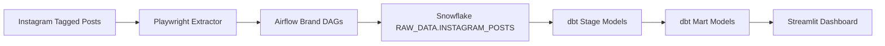
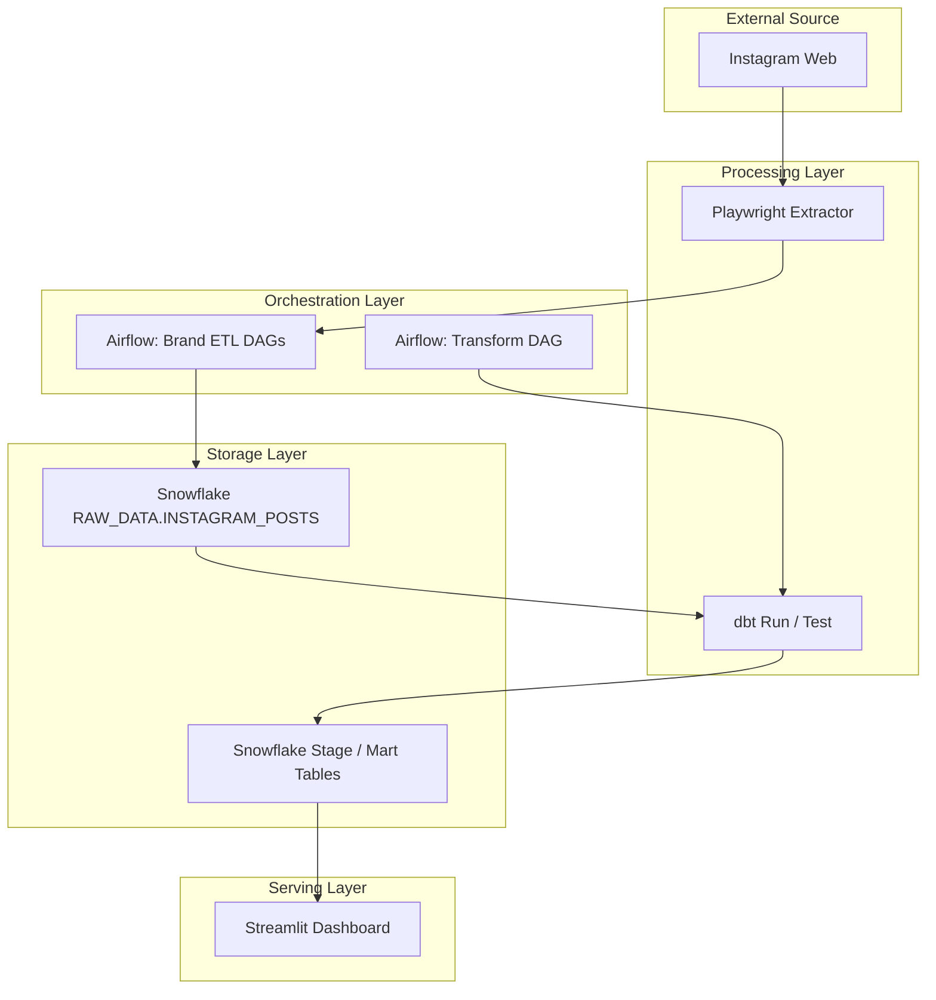
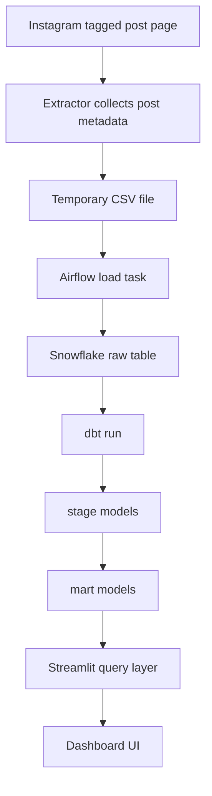

# Architecture Diagram

이 문서는 `insta_pipeline`의 전체 기술 아키텍처를 한눈에 보기 위한 문서입니다.  
Figma, Notion, README 등에 옮겨 그릴 때 기준으로 사용할 수 있도록 단순한 흐름 중심으로 정리했습니다.

## 1. High-Level Architecture

## 2. Runtime Components

## 3. Detailed Flow

## 4. Main Responsibilities By Layer

### Source

- Instagram 웹 페이지에서 tagged post 데이터 확인
- 공식 API가 아닌 웹 UI 기반 수집

### Extract

- Playwright로 브랜드 tagged post 접근
- 게시물 ID, 계정 ID, 링크, 이미지, 날짜, 태그 정보 수집

### Orchestration

- Airflow가 브랜드별 수집 스케줄 관리
- 적재 완료 후 transform DAG 실행
- DAG 간 실행 순서 제어

### Storage

- Snowflake raw 테이블에 원천성 데이터 적재
- dbt를 통해 stage, mart 레이어 생성

### Transform

- tagged account 정리
- 교집합 계정 집계
- 브랜드 연관성 분석용 테이블 생성

### Serving

- Streamlit에서 브랜드 선택
- 관련 계정/연관 브랜드 결과 확인

## 5. Suggested Figma Layout

Figma에서 그릴 때는 왼쪽에서 오른쪽으로 배치하는 것이 가장 보기 좋습니다.

추천 순서:

1. Instagram
2. Extractor
3. Airflow
4. Snowflake Raw
5. dbt Stage
6. dbt Mart
7. Streamlit Dashboard

추천 그룹 색상:

- Source: 회색
- Extract / Orchestration: 파란색
- Storage / Transform: 초록색
- Serving: 주황색

추천 보조 라벨:

- `Extract`: Playwright
- `Orchestrate`: Airflow
- `Load`: Snowflake
- `Transform`: dbt
- `Serve`: Streamlit

## 6. One-Line Summary

이 프로젝트는 Instagram tagged post 데이터를 수집한 뒤,
Airflow로 적재를 관리하고 Snowflake + dbt로 분석용 모델을 만든 후,
Streamlit 대시보드에서 결과를 확인하는 end-to-end 데이터 파이프라인입니다.
